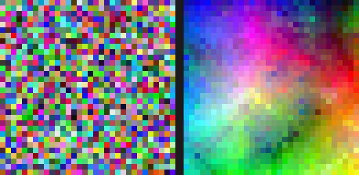

# Self-Sorting Map (SSM) in Python

A Python implementation of the core Self-Sorting Map (SSM) algorithm, based on the paper [“Self-Sorting Map: An Efficient Algorithm for Presenting Multimedia Data in Structured Layouts”](https://home2.htw-berlin.de/~barthel/veranstaltungen/IR/uebungen/SelfSortingMap.pdf) by Grant Strong and Minglun Gong.

This project focuses on the paper's core 2D square-grid SSM procedure: alternating shifted block groupings, neighborhood-based target computation, and exhaustive 4-item alignment within each grouped quadruple. It is intended as a clear and practical Python version of the main algorithm for fully filled power-of-two grids, rather than a complete reproduction of every variant and engineering optimization discussed in the paper.

## Features

- **Faithful Core Mechanics:** Implements the main 2D SSM loop with alternating shifted block groupings and neighborhood-based targets.
- **Dual Data Modes:**
  - `real`: Computes block targets using the mean vectors of the neighborhoods.
  - `nominal`: Computes targets using the exact medoid (the item minimizing total dissimilarity within the neighborhood).
- **Arbitrary Distance Metrics:** Supply any custom distance function (e.g., Euclidean, Cosine) to define item dissimilarity.
- **Zero Dependencies (Core):** The core algorithm is built entirely on standard Python and NumPy.
- **DPQ (optional):** With `dpq.py` in the project, the RGB demo reports **Distance Preservation Quality (DPQ)**—agreement between pairwise distances in feature space and distances on the 2D grid (higher is better, max 1).

## Requirements

- Python 3.10+
- **numpy** (for vector math and array handling)
- **pillow** (optional, for running the visual RGB test script)

## Installation

Clone the repository and ensure you have the required dependencies installed:

```bash
pip install numpy pillow
```

## Quick Start: Running the Demo

The provided script includes a built-in test that generates a grid of random RGB colors and sorts them using the SSM algorithm.

To run the demo:

```bash
python self_sorting_map.py
```

This will initialize a 32×32 grid of random colors, organize them so that similar colors cluster together, and write `ssm_rgb_initial.png` and `ssm_rgb.png` (raw grids), plus `ssm_rgb_readme.png` (side-by-side, upscaled for documentation) in your current directory.

### Before / after (RGB demo)

Shuffled grid before SSM (left) and sorted layout after SSM (right). *8× nearest-neighbor upscale so pixels stay visible in the README.* The demo also prints **Distance Preservation Quality (DPQ)** for the sorted grid; in the sample run below it is **≈ 0.9149** (higher is better).



### Sample output (`self_sorting_map.py`)

```text
Saved -> ssm_rgb_initial.png
  block=  8    482.8ms
  block=  4    940.4ms
  block=  2    914.6ms
  block=  1   1898.9ms
SSM fit completed in 4.237s  (4237.0ms)
Distance Preservation Quality: 0.9149314189025235
Saved -> ssm_rgb.png
Saved -> ssm_rgb_readme.png
```

## Usage in Your Projects

You can integrate the `SelfSortingMap` class into your own data visualization pipelines.

```python
import numpy as np
from self_sorting_map import SelfSortingMap, euclidean_distance

# 1. Define your grid size (MUST be a power of two, >= 8)
N = 32

# 2. Prepare your data items (must be exactly N * N items)
# Example: 1024 random 3D vectors
my_data = [np.random.rand(3) for _ in range(N * N)]

# 3. Initialize the Map
ssm = SelfSortingMap(
    grid_size=N,
    distance_fn=euclidean_distance,
    data_mode="real",  # use "nominal" for non-vector data like text/graphs
    max_iters=4,       # small per-stage iteration cap; tune per dataset
    seed=42,
)

# 4. Fit the data
ssm.fit(my_data, verbose=True)

# 5. Retrieve the sorted 2D grid layout
layout = ssm.get_layout()

# Access item at row 0, col 0
top_left_item = layout[0][0]
```

## Implementation Scope & Deviations

This implementation is best described as a Python version of the paper's core 2D SSM algorithm, with a few deliberate simplifications and omissions:

- **Square, fully filled maps only:** The code currently expects exactly \(N \times N\) items on a square grid where \(N\) is a power of two.
- **No boundary conditions:** The paper describes using fixed external items to bias the organization near the border; that feature is not implemented here.
- **No placeholder cells:** The paper discusses handling underfilled maps with placeholders; this implementation does not include that extension.
- **Nominal mode favors exactness over speed:** For nominal datasets, the code uses the exact Equation 6 medoid/centroid search over the neighborhood rather than the paper's faster approximate reduction strategy, so it can be much slower on large datasets.
- **CPU reference implementation:** The paper also presents GPU-oriented acceleration and performance engineering; this repository focuses on a readable Python implementation of the underlying algorithm instead.

## References

Strong, G., & Gong, M. (2014). Self-Sorting Map: An Efficient Algorithm for Presenting Multimedia Data in Structured Layouts. *IEEE Transactions on Multimedia*, 16(4), 1045–1058.
