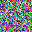

# Self-Sorting Map (SSM) in Python

A highly faithful Python implementation of the Self-Sorting Map (SSM) algorithm, based on the paper [“Self-Sorting Map: An Efficient Algorithm for Presenting Multimedia Data in Structured Layouts”](https://home2.htw-berlin.de/~barthel/veranstaltungen/IR/uebungen/SelfSortingMap.pdf) by Grant Strong and Minglun Gong.

The SSM is an algorithm designed to organize and present high-dimensional or nominal multimedia data (such as images, colors, or text documents) into a structured, non-overlapping 2D grid. It guarantees that the most related items are placed close together, while unrelated items are pushed far apart. Unlike traditional dimension reduction techniques like MDS or SOM, SSM transforms the continuous optimization problem into a discrete labeling problem, ensuring an occlusion-free layout directly.

## Features

- **Mathematically Faithful Core:** Accurately implements the alternating shifted block groupings and offset neighborhood calculations described in the paper.
- **Dual Data Modes:**
  - `real`: Computes block targets using the mean vectors of the neighborhoods.
  - `nominal`: Computes targets using the exact medoid (the item minimizing total dissimilarity within the neighborhood).
- **Arbitrary Distance Metrics:** Supply any custom distance function (e.g., Euclidean, Cosine) to define item dissimilarity.
- **Zero Dependencies (Core):** The core algorithm is built entirely on standard Python and NumPy.

## Requirements

- Python 3.10+
- **numpy** (for vector math and array handling)
- **pillow** (optional, for running the visual RGB test script)

## Installation

Clone the repository and ensure you have the required dependencies installed:

```bash
pip install numpy pillow
```

## Quick Start: Running the Demo

The provided script includes a built-in test that generates a grid of random RGB colors and sorts them using the SSM algorithm.

To run the demo:

```bash
python self_sorting_map.py
```

This will initialize a 32×32 grid of random colors, organize them so that similar colors cluster together, and write `ssm_rgb_initial.png` (shuffled layout before SSM) and `ssm_rgb.png` (sorted result) in your current directory.

### Random initial grid

Shuffled grid before SSM (`self_sorting_map.py` demo):



### Sample output (`self_sorting_map.py`)

```text
Saved -> ssm_rgb_initial.png
  block=  8    525.1ms
  block=  4    958.3ms
  block=  2    749.1ms
  block=  1   1928.4ms
SSM fit completed in 4.161s  (4161.2ms)
Distance Preservation Quality: 0.9103005543500685
Saved -> ssm_rgb.png
```

## Usage in Your Projects

You can integrate the `SelfSortingMap` class into your own data visualization pipelines.

```python
import numpy as np
from self_sorting_map import SelfSortingMap, euclidean_distance

# 1. Define your grid size (MUST be a power of two, >= 8)
N = 32

# 2. Prepare your data items (must be exactly N * N items)
# Example: 1024 random 3D vectors
my_data = [np.random.rand(3) for _ in range(N * N)]

# 3. Initialize the Map
ssm = SelfSortingMap(
    grid_size=N,
    distance_fn=euclidean_distance,
    data_mode="real",  # use "nominal" for non-vector data like text/graphs
    max_iters=4,       # Default based on the paper
    seed=42,
)

# 4. Fit the data
ssm.fit(my_data, verbose=True)

# 5. Retrieve the sorted 2D grid layout
layout = ssm.get_layout()

# Access item at row 0, col 0
top_left_item = layout[0][0]
```

## Implementation Details & Deviations from the Paper

This implementation captures the precise mechanics of the SSM algorithm, but features a few minor quality-of-life differences from the complete scope of the original publication:

- **Strict True Centroids for Nominal Data:** For nominal datasets, the paper suggests computing “approximate centroids” using parallel reduction to save time on large datasets. This implementation strictly evaluates the true centroid according to Equation 6. This makes the code mathematically exact, though potentially slower for very large nominal datasets.
- **No Boundary Conditions:** The paper outlines a method to enforce boundary conditions (e.g., pinning a specific color to the top of the map) by using external items during target calculation. This script currently operates without boundary constraints.
- **Strict Grid Filling:** The algorithm requires exactly \(N \times N\) items (where \(N\) is a power of two). It does not currently support filling empty cells with placeholders for datasets that do not perfectly fit the grid size.

## References

Strong, G., & Gong, M. (2014). Self-Sorting Map: An Efficient Algorithm for Presenting Multimedia Data in Structured Layouts. *IEEE Transactions on Multimedia*, 16(4), 1045–1058.
